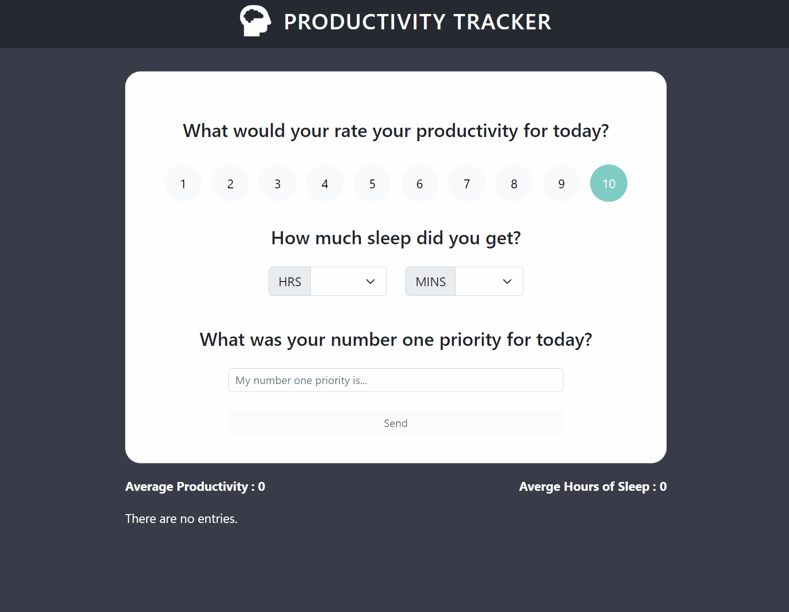

# Productivity Tracker

*A frontend application that utilizes React and React Hooks to track productivity.*

Try it [here](https://productivitytracker-bh.netlify.app/)

## Summary

This application uses, react, functional components, and react hooks to create a frontend application that tracks a users productivity. The goal of this application was to get familiar with functional components and react hooks. This application utilizes local storage to create a mock backend. THis allows the application to have CRUD operations. The user has the ability to create, edit, and delete their logged data. From the data the user can notice trends in their productity based on their sleeping patterns and moniotr important tasks for each day.

## Author

* **Bryan Herrera** - *Full-Stack Developer* - [Website](http://bryan-herrera.com) | [LinkedIn](https://www.linkedin.com/in/herrerabryan/)  